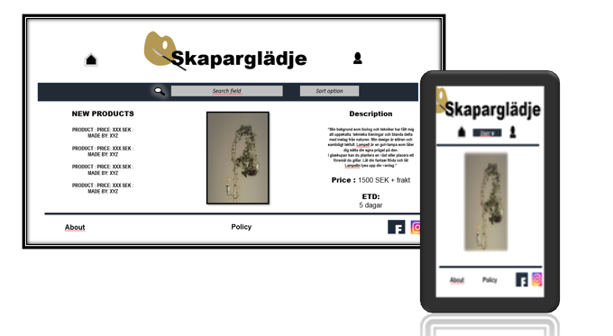

# Homemade

#### The aim with this market platform is to offer a channel for private persons to marketing and sell their homemade projects without involving middle hands and offer buyers unique products which are not already out on the market.

##### The interest for digital markets are growing, at the same time the will in finding local, unique and environmental friendly products are also increasing. Today there are lots of options in buying products over the internet and there are also channels were people marketing their own ideas. Although these channels are usely limited to a narrow interest field. Our aim is to combine the growing interest of digital markets with the hunger for localy made and unique products. We aim to be a platform were you can find a large variety of homemade products. We want to make it simple for innovators to bring their ideas to the market and allow buyers to find local, unique and homemade products. 

 
## UX

### User story
#### We aspect this platform to be used as an alternative to marketplaces that advertises products that already are establish on the market

#### Typical user would be 
- Innovators that in an easy way wants to try if their products are ready for the market
- Buyers who are looking for something unique that not already exist on the market today
 
#### We suppose users in the two categories  above will be in the agespan between 18 to 65 year

#### These two categories have different needs
- Innovator are aspected to ask for an easy, 
intuative tool for publishing images, description, 
price and details connected to their products. 
The outcome from this tool should be published in 
such way that the product stands out and is easy to 
find and that the product's unique selling point are 
adressed. For publishing their ideas the probably
 prefer to use a computer.

- Buyer need a tool to in simple maner find products 
within their scope of interest. The product should
 also be presented in a way that it is easy to make
  a decision to buy our not. The search for unique 
  products should not be limited by device type used. 
  Products should be just as easy to find on the 
  telephone as on the computer.

#### The wide age-range could be divided into smaller categories after their expectation

- 18- 25 years are looking for something with a 
WOW-factor something new and trendy with a cool and 
interactive design which could be viewed on the telephone.

- 25- 45 years are looking for a clear, informative platform where it is easy to find and evualate products, which is applicable both on computer and mobile devices

- 45 - 65 years are looking for a simple, easy-to-use and informative platform, not so much pop-ups and extra informations, their first alternativ are probably to use a computer

### Decisions to make

The different user and age-spans have different needs and expectation therefore we have to find a compromise on how this platform should be set up.
#### Decisions to make are 
- Weither the contents should be written in local language or in English.
- If it should be appealing for the older or younger age span
- If it should have simple or functional advanced appearance

#### Decisions made for the first protype are

1. Adopting a simple design where products are the main focus
2. The design should be responsive
3. The responsive design should be adopted with the users need in mind
4. Main focus on mobile design should be focusing on buyers and younger age-span
5. Main focus on computer design should be focusing on innovators and older age-span
6. Clone and link it to social media such as twitter, facebook, linked-in

#

Problems/Opportunities | Importance | Viability/Feasibility|
-----------------------|------------|----------------------|
Create an online presence |	4|4
Conduct a market research|4|	2
Make design responsive|5|4
Adjust the design after user categories|4|4
Draw attention via Social media|	5	|3
|||
Sum	|22	|17

#

### Wireframe
#### Large devices
[Wireframe](assets/documents/Computer_wireframe.pdf "Wireframe large devices")
#### Small devices
[Wireframe](assets/documents/Wireframe_small%20devices.pdf "Wireframe snall devices")

#

### Analysis of Strength, Weakness, Opertuinity, Treats

#### Strength 
- Unique , innovative, easy-to-use, easy to navigate, easy to publishing ideas, direct connection between buyers and innovators, responsive design, wide range of products, cloned and linked to social media

#### Weakness
- New on the market, need to reach a critical numbers of products/users, no safe payment solution, no quality garantee on products, compete with gigants such as facebook, twitter, amazon, yellowpages etc..

#### Opertuinity
- Increase visitors/users by cloning platform to social media
- Make it easy to find the platform through search-optimising
- Keep visitor coming back to webpage through call to action, newsletters etc.
- Get user engaged through interaction (feedback from, chat-function etc..)
- Increase costumer satisfaction through offering tools and information to simplify the marketprocess

#### Treats
- Companies with similar platform for already established products such as
Twitter, Facebook,Amzon, Blocket, Yellowpage, Tradera
Alibaba

#

## Features

### Prototype
#### Should have a simple, responsive design, with minimal requirements

Features|	Content	|Difficulty level
--------|-----------|----------------|
Head | Title and content| 1
Simple and unified design| Header, 3 section, footer| 1
Home page, profile page (seller/buyer), publish form page, ordering page, about and policy page| |3|
Responsive design| depends on device | 3
Header | Logo and navbar | 2
Section | List with products / Product Image / Product description |2
Footer | links to policy / Social media / About | 2
Navbar | Form with useroption (Seller or Buyer) / Bolean search field / Form with product categories / form with sort result after price, date etc..| 4
List with products | Link with result from navbar| 4|
Product Image | connected to search result | 3|
Product describtion | connected to search result | 3|

		
#

### Time plan

#### Part 1.

1. Construct a simple responsive design using HTML, CSS, Bootstrap
2. Test and validate the design through google inspection tool, lighthouse and CCS3/HTML-validator
3. Collect feedback
4. Deploy Prototype

#### Part 2.

1. Use google analytics to analysis to see which categories that uses the platform and their behavior on the platform
2. Update the platform in agreement wiyh comlusions made from above analysis
3. Add call-to-action
4. Use social channels to draw traffic to the platform
5. Set a time schedule when make advertisments on social media

##### Part 3.

1. Use google ananlytics to see behavoir and traffic on the homepage
2. Adjust the platform from conclusion made
3. Create a news-letter with a defined schedule
4. Made decision of how far to take this innovation

## Technologies that will be used

##### HTML, CSS, Bootstrap, fontawesome, Google analytics

## Testing

#### 
1. At early stage lighthouse and google inspections tool will be used, to assure for good and stabil reponsive design
2. After assuring stable visual appealing and responsive design the commited code will be deployed through GITHUB masterbranch,
the deployed site will be sent out to beta-tester for feedback
3. The platform will be update in accordance with feedback from beta-tester
4. The updated site would once more be tested via google inspection tool and lighthouse
5. When the design is consider to forfill all requirements from above inspection tools, the code will be validated via CSS3/HTML-validation tool
6. After assuring a good and stable code the project will be deployed and sent to mentor for comments

## Deployment

##### The code is made using Gitpod-editor 
##### The code will be pushed to GITHUB through using
- git add, git commit and git push commands
##### In GITHUB repository the code will be deployed to a masterbransch

## Credits

### Content
- will be added continuosly

### Media
- - will be added continuosly

### Acknowledgements

- will be added continuosly

